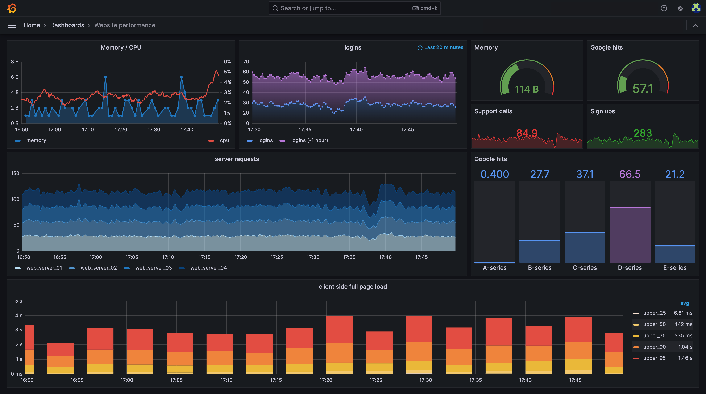
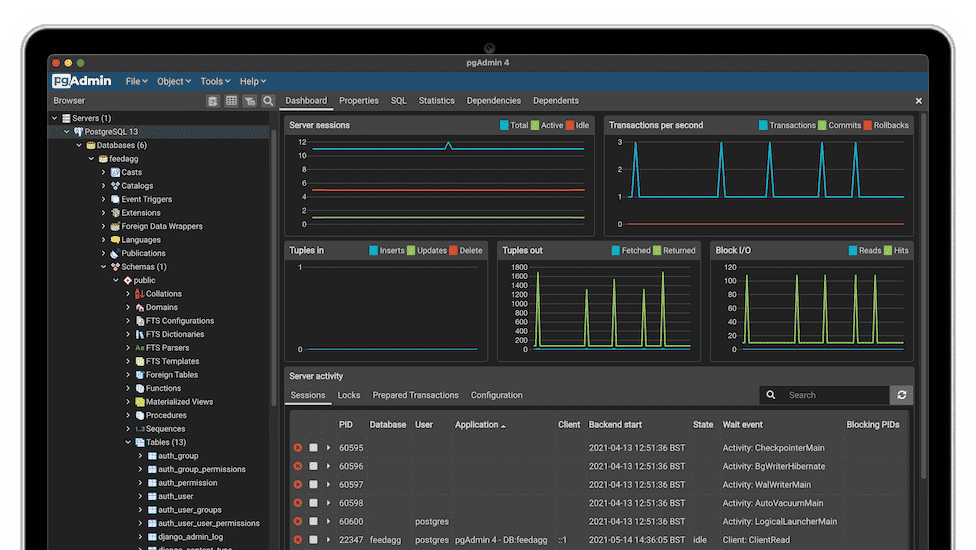

# Grafana with Docker Compose and Postgresql

## ✔️ Requirements

- [Docker](https://www.docker.com/get-started/)
- [Docker Compose](https://docs.docker.com/compose/install/)

## 👣 Instructions

1. Create a .env file inside the repository root folder.
2. Add the following parameters.
   - POSTGRES_PASSWORD=[database password]
   - POSTGRES_USER=[database user]
   - POSTGRES_DB=[database name]
   - PGADMIN_DEFAULT_EMAIL=[pgAdmin user]
   - PGADMIN_DEFAULT_PASSWORD=[pgAdmin password]
3. Save the file
4. Run Docker Compose

   ```bash
   docker compose up -d
   ```

5. Access **Grafana** through http://localhost:3000
   
6. Access **pgAdmin** through http://localhost:5050
   

## 🖊️ Notes

- You can always change the ports if you want.
- If you prefer to change the PostgreSQL data folder, set it to a new destination in the volume configuration.
